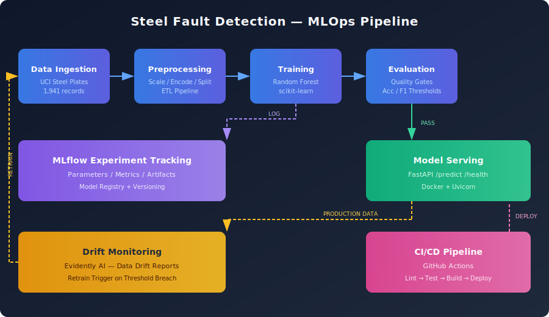

# Steel Plate Fault Detection - MLOps Pipeline

An end-to-end MLOps pipeline for classifying surface defects on steel plates. Built to demonstrate production-grade ML lifecycle management: data ingestion, model training with experiment tracking, containerized serving, CI/CD, and drift monitoring.

## Architecture

<p align="center">
  
</p>

## Tech Stack

| Component | Tool |
|---|---|
| Language | Python 3.12 |
| ML Framework | scikit-learn |
| Experiment Tracking | MLflow |
| Model Serving | FastAPI + Uvicorn |
| Containerization | Docker + Docker Compose |
| CI/CD | GitHub Actions |
| Monitoring | Evidently AI |
| Linting | Ruff |
| Testing | pytest |

## Dataset

[UCI Steel Plates Faults](https://archive.ics.uci.edu/dataset/198/steel+plates+faults) — 1,941 steel plate inspections with 27 image-derived features, classified into 7 fault types: Pastry, Z_Scratch, K_Scratch, Stains, Dirtiness, Bumps, Other_Faults.

## Quick Start

### Local Development

```bash
# Setup
make setup
source venv/bin/activate

# Run full pipeline
make pipeline    # fetch -> preprocess -> train -> evaluate

# Start the prediction API
make serve

# Test
make test
```

### Docker

```bash
# Start MLflow + training + serving
docker compose up --build

# Predict
curl -X POST http://localhost:8000/predict \
  -H "Content-Type: application/json" \
  -d '{"features": [42,50,270900,270944,267,17,44,24220,76,108,1687,0,1,100,0.0839,0.6015,0.7781,0.0,0.2893,1.0,0.0,2.4265,-0.3665,1.6439,-0.471,-0.2035,0.3862]}'
```

### API Endpoints

| Method | Endpoint | Description |
|---|---|---|
| GET | `/health` | Health check |
| POST | `/predict` | Predict fault type from 27 features |
| GET | `/docs` | Interactive API documentation (Swagger) |

## Project Structure

```
├── src/
│   ├── data/
│   │   ├── fetch_data.py        # Download dataset from UCI
│   │   └── preprocess.py        # ETL: clean, encode, scale, split
│   ├── train/
│   │   └── train.py             # Train with MLflow tracking
│   ├── evaluate/
│   │   └── evaluate.py          # Quality gates before deployment
│   └── serve/
│       └── app.py               # FastAPI prediction endpoint
├── monitoring/
│   └── drift_detection.py       # Evidently data drift reports
├── docker/
│   ├── Dockerfile.train         # Training container
│   └── Dockerfile.serve         # Serving container
├── .github/workflows/
│   ├── ci.yml                   # Lint → Test → Docker build
│   └── cd.yml                   # Full pipeline on tagged release
├── tests/
│   ├── test_preprocess.py       # Data pipeline tests
│   └── test_api.py              # API endpoint tests
├── configs/
│   └── model_config.yaml        # Centralized configuration
├── docker-compose.yml           # MLflow + Train + Serve
├── Makefile                     # Dev workflow shortcuts
└── requirements.txt
```

## ML Pipeline Details

### 1. Data Ingestion & ETL
- Fetches the Steel Plates Faults dataset from UCI ML Repository
- Converts one-hot encoded targets to single-label classification
- Applies StandardScaler normalization
- Stratified train/test split (80/20)
- Saves preprocessing artifacts (scaler, label encoder) for serving

### 2. Training & Experiment Tracking
- Random Forest classifier with configurable hyperparameters
- MLflow logs: parameters, metrics, model artifacts, feature importances
- Model registered in MLflow Model Registry

### 3. Evaluation & Quality Gates
- Minimum accuracy and F1 thresholds block bad models from deployment
- Classification report per fault type
- Automated in CI/CD pipeline

### 4. Model Serving
- FastAPI with `/predict` endpoint
- Returns predicted fault type, confidence score, and class probabilities
- Health check endpoint for container orchestration

### 5. Monitoring
- Evidently AI drift detection compares production data to training reference
- Generates HTML reports for visual inspection
- Can trigger retraining when drift exceeds threshold
